# Deep Painterly Harmonization

A TensorFlow implementation of "[Deep Painterly Harmonization](https://arxiv.org/abs/1804.03189)".

  
  
  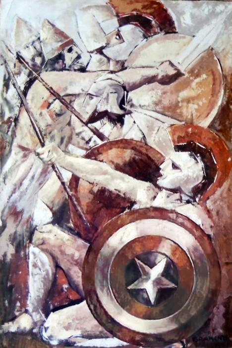

## Setup

Requirements:
* Tensorflow (tested with version 1.13)
* OpenCV (if you want to run the post processing you will also need to install the contrib modules)
* scikit-learn
* SciPy
* NumPy

You also need to download the VGG19 model weights from [here](http://www.vlfeat.org/matconvnet/models/imagenet-vgg-verydeep-19.mat).

## Usage

Run ``deep_painterly_harmonization.py -c content.png -s painting.png -o output.png``.

Optional Arguments:
* ``-m``: Mask image (a black image with the inserted objects marked in white). If not provided, the program generates one 
automatically.
* ``-a``: Hyperparameter regarding how stylized the target painting is. Corresponds to the output of the painting estimator 
in the paper.
* ``--vgg``: Path of the the VGG19 weights.
* ``--max_size``: Maximum height or width of the images. Default is set to 700.
* ``--num_cores``: Number of processes to use for the post processing.
* ``--only``: Can be used to run only parts of the image generation pipeline (``pass1``, ``pass2``, ``post``). For example to 
skip the second pass, you could run the program with ``--only pass1 post`` . When skipping the first pass or only running the
post processing, you might want to provide the output of the previous skipped stage with ``--inter_res``.

To see a description of the other arguments, run ``deep_painterly_harmonization.py -h``.

## Notes

* There were a few cases where the original code of the authors contradicted the statements in their paper. In these cases I
tried to follow the code.
* The histogram loss for the second pass is implemented but does not seem to function properly and is deactivated for now.
* The painting estimater to classify art styles is not implemented yet. You can set the style value with the parameter ``-a``.

## Acknowledgement

* See the [original code](https://github.com/luanfujun/deep-painterly-harmonization) for the paper.
* This [blog post](https://sgugger.github.io/deep-painterly-harmonization.html) by Sylvain Gugger was also really helpful.

## Examples

These are the results for a few of the original examples by the authors. You can find all examples in the ``output/`` directory.
To generate these examples, use the script ``run_examples.py``.

  
  
  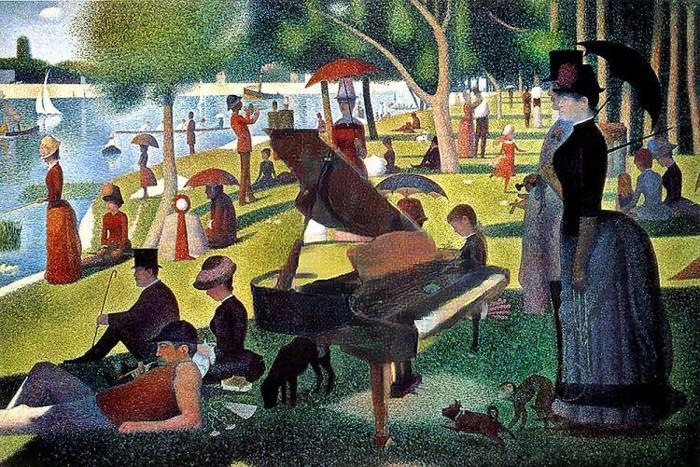

  
  
  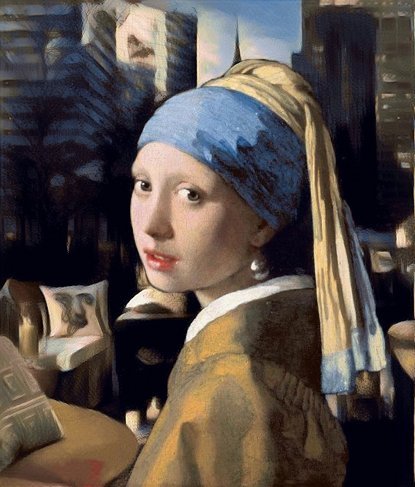

  
  
  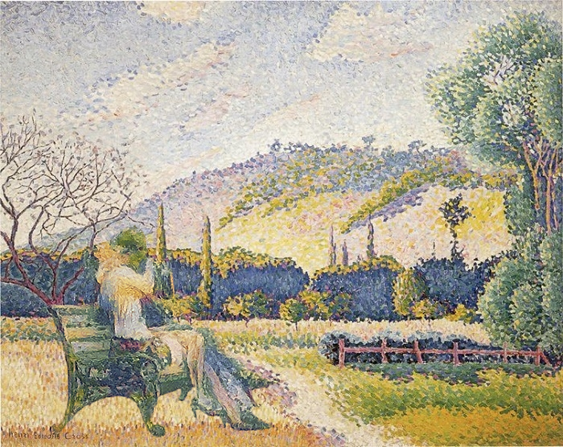

  
  
  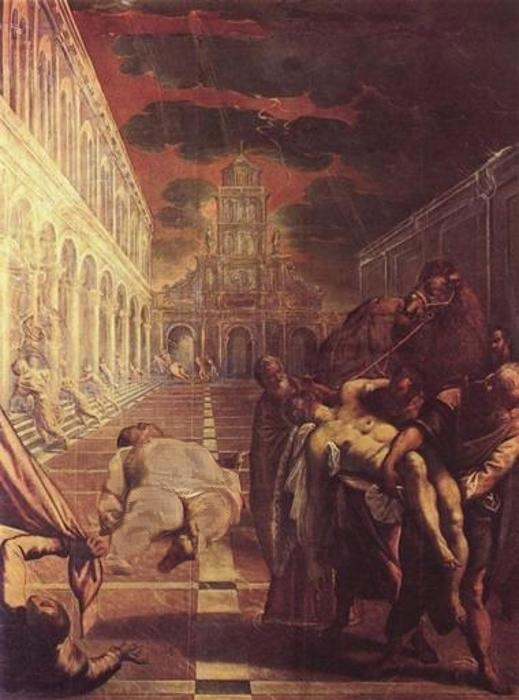

  
  
  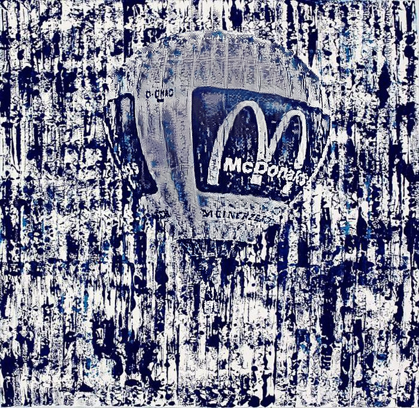

  
  
  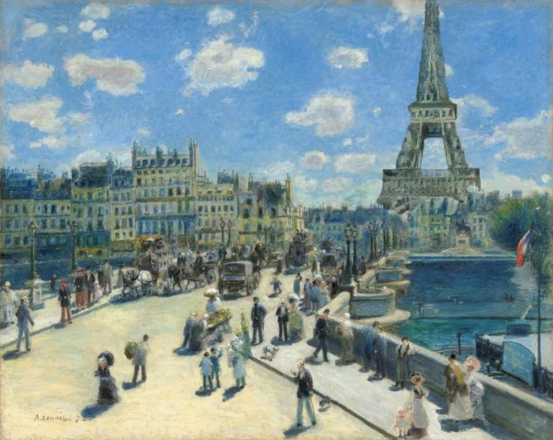

  
  
  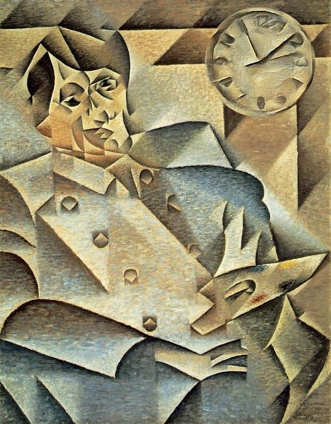

  
  
  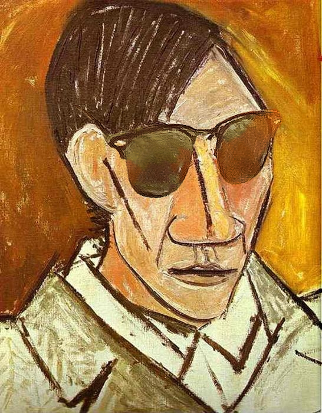

  
  
  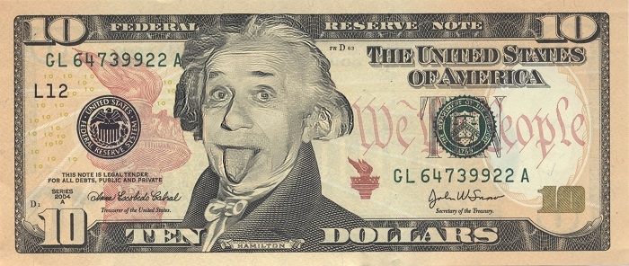

  
  
  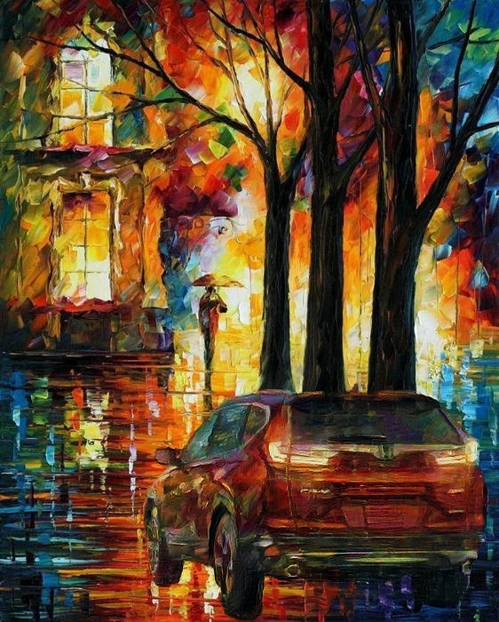

  
  
  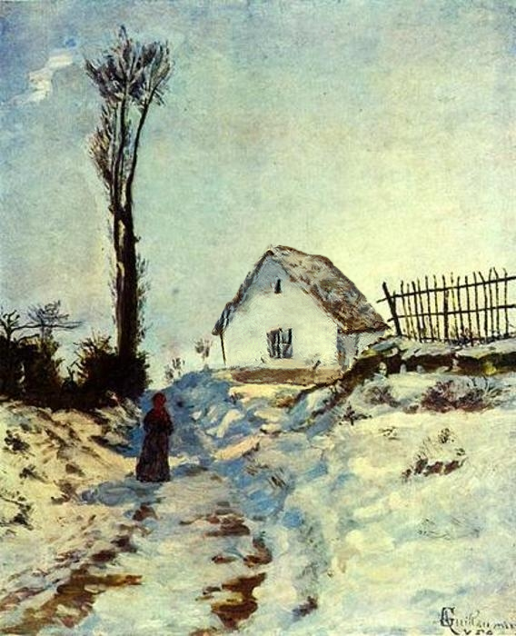

  
  
  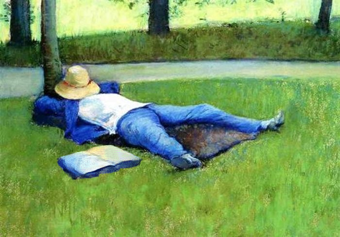

  
  
  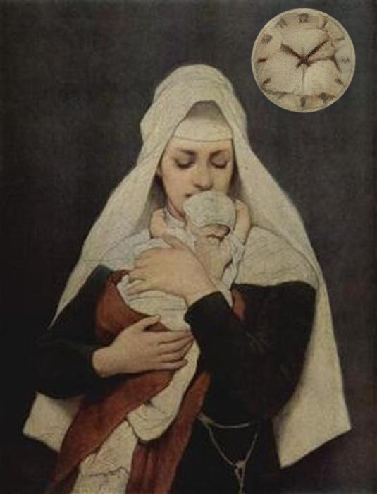

